# Um ponto de partida para discussões sobre arquitetura de sistemas

## Os 12 princípios da Tecnologia e Produto no Pravaler

- Começar pelo porquê é melhor do que começar pelo como
- Experimentamos. Aprendemos. Melhoramos. Repetimos.​

Encontre os outros 10 princípios aqui:  
https://twitter.com/danicuki/status/1352239919494803458

## Arquitetura?

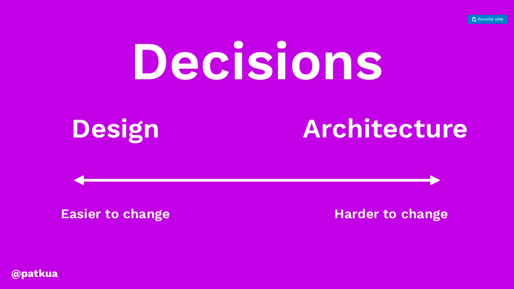

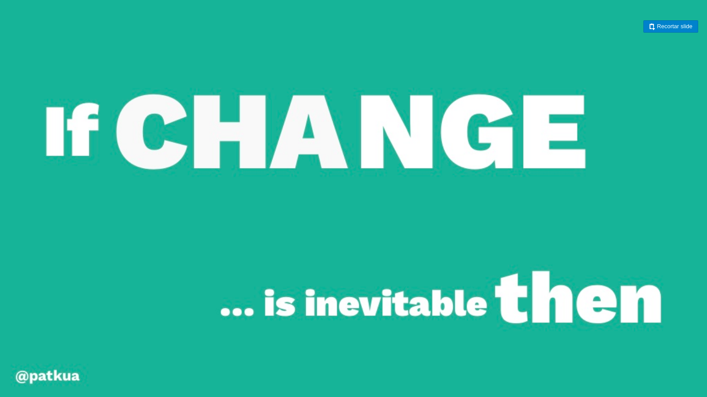

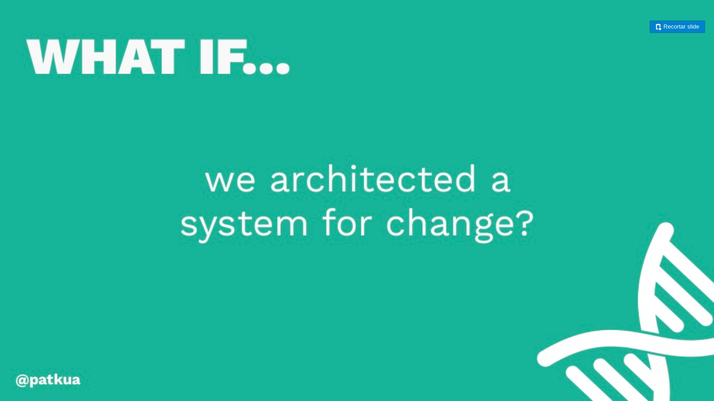

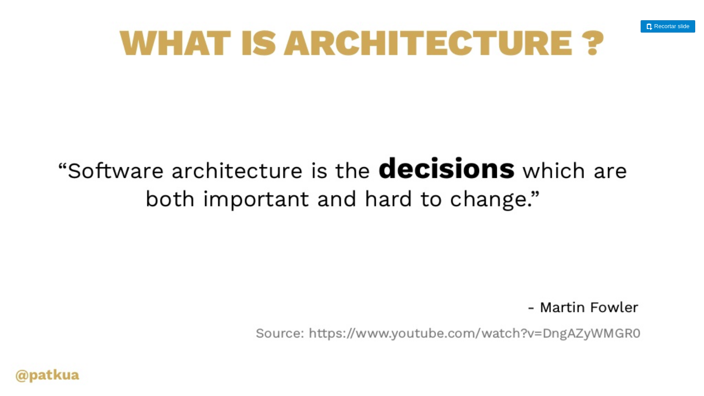

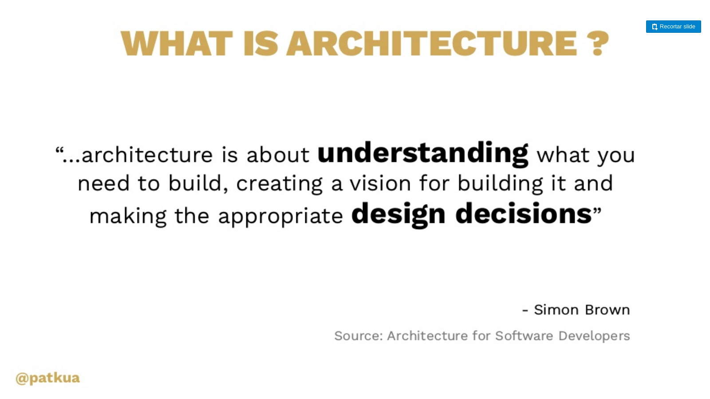

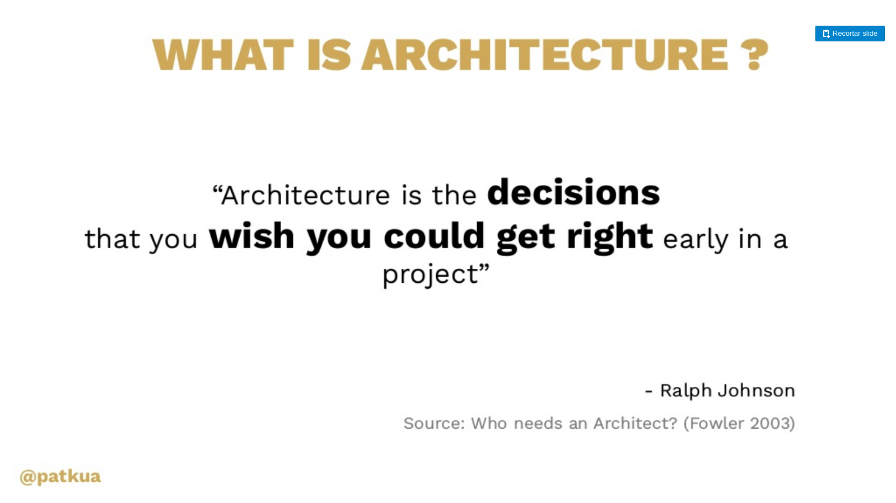

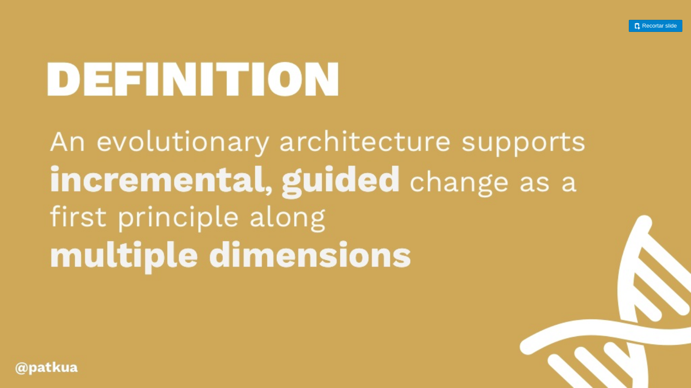

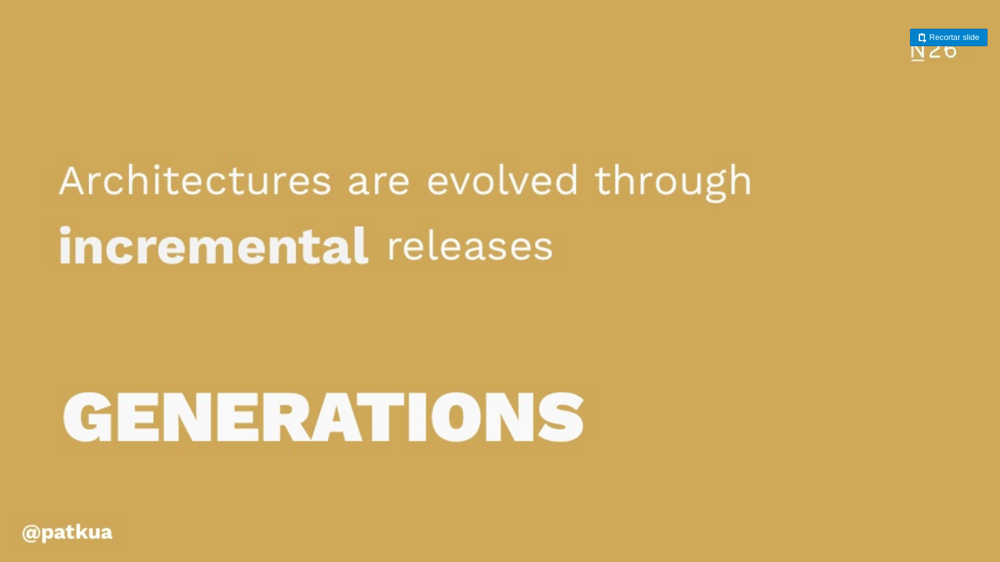

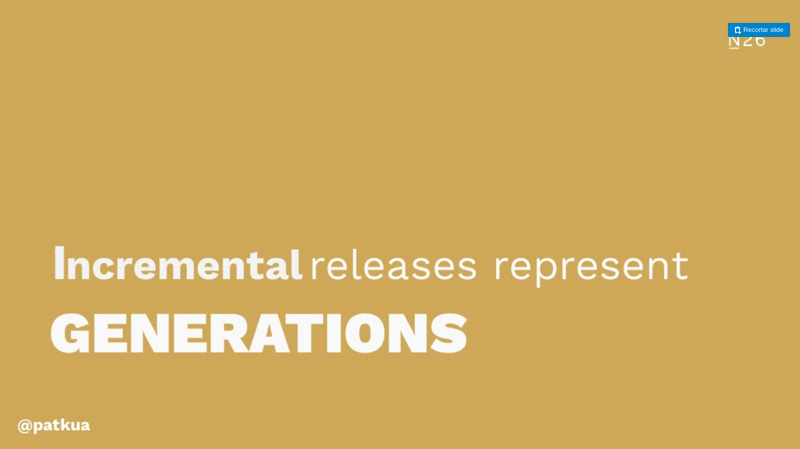

## Referências

### (Talk) Scaling Architecture Decision Making (Trendyol Istanbul Meetup Jan 2020)
https://pt.slideshare.net/patkua/scaling-architecture-decision-making-trendyol-istanbul-meetup-jan-2020
> In the fast moving startup world, there’s often not a lot time to think about architecture. As I grew N26 Tech almost 8x to 370 people in just over two years, I wanted to make sure we made good technical decisions and not just grow chaotically.
> 
> This talk explores how we introduced a number of practices how to decentralise and scale out architectural decision making.
— Patrick Kua, Independent Consultant

### (Keynote) Building Evolutionary Architectures** (W-Jax Munich Nov 2019) Nov 2019 Keynote
https://pt.slideshare.net/patkua/building-evolutionary-architectures-wjax-munich-nov-2019-nov-2019-keynote
>In our industry, one of the only guarantees is change. Many of today’s tools, technologies, and business models will soon cease to exist, only to be replaced by newer ones. Architects face the challenge of planning for today’s systems knowing that the problems of tomorrow will be completely different from the problems of today. Evolutionary architecture is an architectural approach that prioritises change as a first principle but balances this need with delivering value early.
— Patrick Kua, Independent Consultant

### (Livro) Team Topologies - Organize teams for fast flow

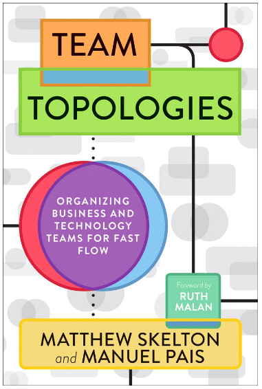
> "Teams that have the right size, **the right boundaries, and the right level of communication** are poised to deliver value to the company and satisfaction to the team members."
— Greg Burrell, Senior Reliability Engineer at Netflix

### (Livro) Domain-Driven Design: Tackling Complexity in the Heart of Software
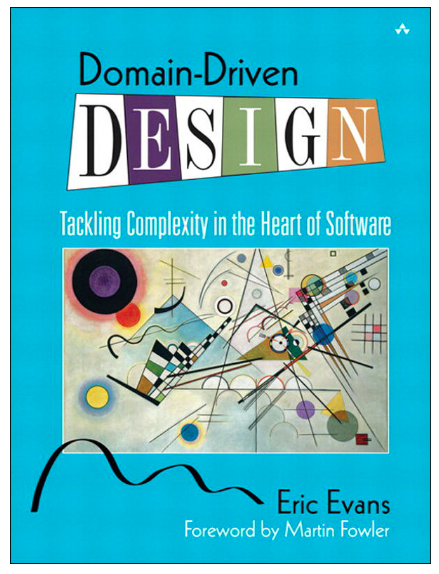
> "The lesson of Eric's experience is that the **really powerful domain models evolve over time**, and even the most experienced modelers find that they gain their best ideas after the initial releases of a system"
— Martin Fowler, Chief Scientist at ThoughtWorks